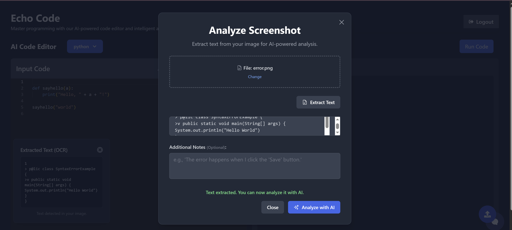

# AI-Powered Code Debug Assistant

 ## Table of Contents

* [About the Project](#about-the-project)
* [Features](#features)
* [Demo](#demo)
* [Technologies Used](#technologies-used)
* [Getting Started](#getting-started)
    * [Prerequisites](#prerequisites)
    * [Installation](#installation)
    * [Environment Variables](#environment-variables)
* [Authentication](#authentication)
* [Contributing](#contributing)
* [License](#license)
* [Contact](#contact)

---

## About the Project

The **AI-Powered Code Debug Assistant** is an innovative developer tool designed to revolutionize the debugging process. Leveraging the power of Large Language Models (LLMs) and intelligent agentic workflows, this assistant helps developers efficiently identify and resolve code errors, even those involving complex UI bugs or log analysis.

This tool aims to simplify debugging by accepting various inputs—code snippets, error logs, screenshots, to provide precise, AI-driven solutions. With multimodal support, it can even analyze diagrams and user interface issues, offering corrected code along with clear rationales for the proposed fixes.

## Features

* **Multimodal Input Support:** Accepts code, logs, screenshots, and error traces for comprehensive analysis.
* **Intelligent Error Extraction:** AI agents are trained to intelligently extract critical error information from diverse inputs.
* **AI-Powered Code Correction:** Utilizes advanced LLM (Gemini) to suggest accurate code fixes.
* **Screenshot Annotation:** Tools for annotating screenshots to highlight specific UI bugs for AI analysis.
* **Code Editing Interface:** Intuitive React-based frontend for seamless code editing and viewing.
* **Real-time Log Viewing:** Integrated features for easy viewing and analysis of application logs.
* **PostgreSQL Database:** Stores User History.
* **Secure Authentication:** Implements JWT tokens for session management and OAuth (Google) for convenient login.
* **File Upload Handling:** Robust backend for secure handling of uploaded screenshots and log files.
* **Real-Time Collaboration:** User can invite peers and they can code together and also ask Ai for Anlaysis on Main Code editor.

## Demo

**🚀 Watch a quick demo of the AI-Powered Code Debug Assistant:**  
[▶️ Click here to watch the demo](https://drive.google.com/file/d/1V-KxiqdS07NZ37WSEnUBMEnizishEzOE/view?usp=sharing)


### Screenshots

Here are some screenshots showcasing different aspects of the application:

| Feature/Page | Screenshot 1 | Screenshot 2 |
| :--------------------- | :------------------------------- | :------------------------------ |
| Dashboard/Main UI |  |  |
| Code Editor |  |  |
| Ai Analysis(Multimodal)|  |  |
| Database(Postgres) |   
---

## Technologies Used

### Frontend

* **React.js:** For building the user interface.
* **Tailwind CSS:** For rapid UI development and styling.
* **Vite:** As the build tool for fast development.

### Backend

* **Node.js:** Runtime environment for the server.
* **Express.js:** Web application framework for RESTful APIs.
* **PostgreSQL:** Relational database for data storage.
* **JWT:** For token-based authentication.
* **OAuth (Google):** For external authentication.
* **Multer:** For handling file uploads (screenshots, logs).

### AI/ML

* **Google Gemini API:** For powerful LLM capabilities (code analysis, suggestions).
* **Computer Vision Models:** For multimodal analysis of screenshots and diagrams.
* **Agentic Workflows:** For error classification and solution generation.

### Real-time 

* **WebSockets (e.g., Socket.IO):** For real-time collaboration features .


## Getting Started

Follow these instructions to get a copy of the project up and running on your local machine for development and testing purposes.

### Prerequisites

Make sure you have the following installed:

* Node.js (v18.x or higher recommended)  
* npm (Node Package Manager) or Yarn  
* PostgreSQL  
* Git  

### Installation

1. **Clone the repository:**

    ```bash
    git clone https://github.com/Harshita-Rupani29/MultiModal-Code-DebugAssistant.git
    cd MultiModal-Code-DebugAssistant
    ```

2. **Backend Setup:**

    ```bash
    cd Backend
    npm install 
    ```

3. **Frontend Setup:**

    ```bash
    cd ../Frontend
    npm install 
    ```

---

### Environment Variables

Create `.env` files in both `Backend` and `Frontend` folders.

#### Backend (`Backend/.env`)

```env
NODE_ENV=development
GOOGLE_API_KEY=your-gemini-api-key
JWT_KEY=your-jwt-secret
PORT=3000
GCP_AI_SDK_LOGLEVEL=DEBUG
CLIENT_URL=http://localhost:5173

DB_USER=postgres
DB_HOST=localhost
DB_DATABASE=codeChat
DB_PASSWORD=your-db-password
DB_PORT=5432

GOOGLE_CLIENT_ID=your-google-client-id
GOOGLE_CLIENT_SECRET=your-google-client-secret

SESSION_SECRET=your-session-secret
```

#### Frontend (`Frontend/.env`)

```env
REACT_APP_BACKEND_URL=http://localhost:3000
```

---

### Database Setup

1. Start PostgreSQL and create your database:

    ```sql
    CREATE DATABASE codeChat;
    ```

2. Run Migrations/Seeders if any:

    ```bash
    npm run migrate
    ```

---

### Running the Application

**Backend:**

```bash
cd Backend
npm start or node index.js
```

**Frontend:**

```bash
cd ../Frontend
npm run dev  # or yarn dev
```

Frontend should now be running at:  
👉 http://localhost:5173

---

### Authentication

Supports:

- JWT (JSON Web Tokens) For Session Management
- OAuth (Google, GitHub integration)

---

### Contributing

1. Fork the project  
2. Create your Feature Branch:  
    ```bash
    git checkout -b feature/AmazingFeature
    ```  
3. Commit your changes:  
    ```bash
    git commit -m 'Add some AmazingFeature'
    ```  
4. Push to the branch:  
    ```bash
    git push origin feature/AmazingFeature
    ```  
5. Open a Pull Request  

---

### License

Distributed under the MIT License. See `LICENSE` for more info.

---

### Contact

**Harshita Rupani**  
📧 harshitarupani4@gmail.com  
🔗 [GitHub Project](https://github.com/Harshita-Rupani29/MultiModal-Code-DebugAssistant.git)
