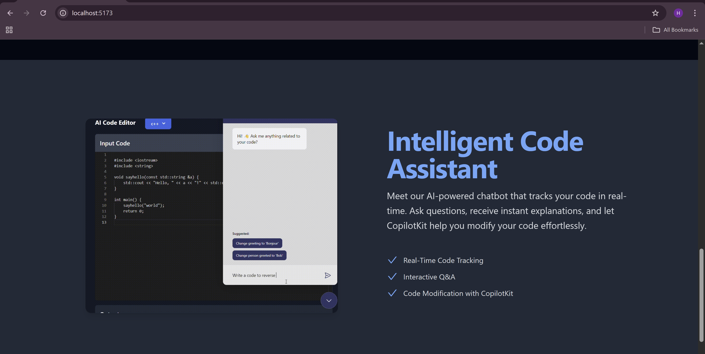

# AI-Powered Code Debug Assistant

 ## Table of Contents

* [About the Project](#about-the-project)
* [Features](#features)
* [Demo](#demo)
* [Technologies Used](#technologies-used)
* [Project Structure](#project-structure)
* [Getting Started](#getting-started)
    * [Prerequisites](#prerequisites)
    * [Installation](#installation)
    * [Environment Variables](#environment-variables)
* [Authentication](#authentication)
* [Contributing](#contributing)
* [License](#license)
* [Contact](#contact)

---

## About the Project

The **AI-Powered Code Debug Assistant** is an innovative developer tool designed to revolutionize the debugging process. Leveraging the power of Large Language Models (LLMs) and intelligent agentic workflows, this assistant helps developers efficiently identify and resolve code errors, even those involving complex UI bugs or log analysis.

This tool aims to simplify debugging by accepting various inputs—code snippets, error logs, screenshots, and tracebacks—to provide precise, AI-driven solutions. With multimodal support, it can even analyze diagrams and user interface issues, offering corrected code along with clear rationales for the proposed fixes.

## Features

* **Multimodal Input Support:** Accepts code, logs, screenshots, and error traces for comprehensive analysis.
* **Intelligent Error Extraction:** AI agents are trained to intelligently extract critical error information from diverse inputs.
* **AI-Powered Code Correction:** Utilizes advanced LLMs (Gemini, GPT-4, Claude 3.5) to suggest accurate code fixes.
* **Rationalized Solutions:** Provides clear explanations and rationales behind each suggested code correction.
* **Screenshot Annotation:** Tools for annotating screenshots to highlight specific UI bugs for AI analysis.
* **Code Editing Interface:** Intuitive React-based frontend for seamless code editing and viewing.
* **Real-time Log Viewing:** Integrated features for easy viewing and analysis of application logs.
* **PostgreSQL Database:** Stores code history and error patterns for continuous improvement and learning.
* **Secure Authentication:** Implements JWT tokens for session management and OAuth (Google/GitHub) for convenient login.
* **File Upload Handling:** Robust backend for secure handling of uploaded screenshots and log files.

## Demo

Watch a quick demonstration of the AI-Powered Code Debug Assistant in action:

<a href="https://drive.google.com/file/d/1V-KxiqdS07NZ37WSEnUBMEnizishEzOE/view?usp=sharing">  </a>

**[Click here to watch the full demo video!](https://www.youtube.com/watch?v=YOUR_YOUTUBE_VIDEO_ID_HERE)** ---

### Screenshots

Here are some screenshots showcasing different aspects of the application:

| Feature/Page | Screenshot 1 | Screenshot 2 |
| :--------------------- | :------------------------------- | :------------------------------ |
| Dashboard/Main UI |  |  |
| Error Analysis |  |  |
| Screenshot Annotation |  |  |
| Settings/Auth |  |  |
---

## Technologies Used

### Frontend

* **React.js:** For building the user interface.
* **Tailwind CSS:** For rapid UI development and styling.
* **Vite:** As the build tool for fast development.

### Backend

* **Node.js:** Runtime environment for the server.
* **Express.js:** Web application framework for RESTful APIs.
* **PostgreSQL:** Relational database for data storage.
* **JWT:** For token-based authentication.
* **OAuth (Google/GitHub):** For external authentication.
* **Multer:** For handling file uploads (screenshots, logs).

### AI/ML

* **Google Gemini API:** For powerful LLM capabilities (code analysis, suggestions).
* **Computer Vision Models:** For multimodal analysis of screenshots and diagrams.
* **Agentic Workflows:** For error classification and solution generation.

### Real-time (Good to have)

* **WebSockets (e.g., Socket.IO):** For real-time collaboration features (if implemented).

## Project Structure
├── .devcontainer/
│   └── devcontainer.json
├── Backend/
│   ├── config/
│   ├── controllers/
│   ├── database/
│   ├── middlewares/
│   ├── models/
│   ├── node_modules/
│   ├── routes/
│   ├── services/
│   ├── uploads/
│   ├── .env
│   ├── .gitignore
│   ├── eng.traineddata
│   ├── index.js
│   ├── package-lock.json
│   ├── package.json
│   └── socket.js
├── Demos/
│   ├── Demo1.png
│   ├── Demo2.png
│   ├── Demo3.png
│   ├── Demo4.png
│   ├── Demo5.png
│   ├── Demo6.png
│   ├── Demo7.png
│   ├── Demo8.png
│   ├── Demo9.png
│   └── EchoCodeDemo.mp4
├── Frontend/
│   ├── node_modules/
│   ├── public/
│   ├── src/
│   │   ├── api/
│   │   ├── assets/
│   │   ├── components/
│   │   ├── images/
│   │   ├── Pages/
│   │   ├── utils/
│   │   ├── App.css
│   │   ├── App.jsx
│   │   ├── index.css
│   │   └── main.jsx
│   ├── .env
│   ├── .gitignore
│   ├── eslint.config.js
│   ├── index.html
│   ├── package-lock.json
│   ├── package.json
│   ├── postcss.config.js
│   ├── README.md
│   ├── tailwind.config.js
│   └── vite.config.js
## Getting Started

Follow these instructions to get a copy of the project up and running on your local machine for development and testing purposes.

### Prerequisites

Make sure you have the following installed:

* Node.js (v18.x or higher recommended)
* npm (Node Package Manager) or Yarn
* PostgreSQL
* Git

### Installation

1.  **Clone the repository:**
    ```bash
    git clone [https://github.com/your-username/your-repo-name.git](https://github.com/your-username/your-repo-name.git)
    cd your-repo-name
    ```
    (Replace `your-username/your-repo-name` with your actual GitHub repository URL.)

2.  **Backend Setup:**
    ```bash
    cd Backend
    npm install # or yarn install
    ```

3.  **Frontend Setup:**
    ```bash
    cd ../Frontend
    npm install # or yarn install
    ```

### Environment Variables

You need to create `.env` files in both the `Backend` and `Frontend` directories based on the examples below.

#### Backend (`Backend/.env`)

```env
NODE_ENV=development
GOOGLE_API_KEY=# Replace with your actual Gemini API Key
JWT_KEY=# Keep this secret and ideally generate a new strong one
PORT=3000
GCP_AI_SDK_LOGLEVEL=DEBUG
CLIENT_URL=http://localhost:5173
DB_USER=postgres
DB_HOST=localhost
DB_DATABASE=codeChat
DB_PASSWORD= # Replace with your PostgreSQL password
DB_PORT=5432

GOOGLE_CLIENT_ID=# Replace with your actual Google Client ID
GOOGLE_CLIENT_SECRET= # Replace with your actual Google Client Secret

SESSION_SECRET= # Keep this secret and ideally generate a new strong one
GOOGLE_GEMINI_API_KEY= # This might be redundant with GOOGLE_API_KEY, use the one your Gemini SDK expects

Frontend (Frontend/.env)
Code snippet

REACT_APP_BACKEND_URL=http://localhost:3000
Database Setup
Create PostgreSQL Database:
Make sure your PostgreSQL server is running. Then, create the database:

SQL

CREATE DATABASE codeChat;
(Or whatever DB_DATABASE you configured).

Run Migrations/Seeders:
If your backend has database migrations or seeders, you'll need to run them. (Add specific commands here if you have them, e.g., npm run migrate).

Running the Application
Start the Backend Server:
From the Backend directory:

Bash

npm start # or node index.js, or npm run dev if you have a dev script
Start the Frontend Development Server:
From the Frontend directory:

Bash

npm run dev # or npm start, or yarn dev
The frontend application should now be accessible at http://localhost:5173 (or the port specified by Vite).

Authentication
The application supports:

JWT (JSON Web Tokens): For managing user sessions after successful login.

OAuth Integration: Seamless login experience using your Google or GitHub accounts.

Contributing
Contributions are what make the open-source community such an amazing place to learn, inspire, and create. Any contributions you make are greatly appreciated.

Fork the Project

Create your Feature Branch (git checkout -b feature/AmazingFeature)

Commit your Changes (git commit -m 'Add some AmazingFeature')

Push to the Branch (git push origin feature/AmazingFeature)

Open a Pull Request

License
Distributed under the MIT License. See LICENSE for more information. (Create a LICENSE file in your root directory if you haven't already).

Contact
Your Name/Team Name - your.email@example.com
Project Link: https://github.com/your-username/your-repo-name
